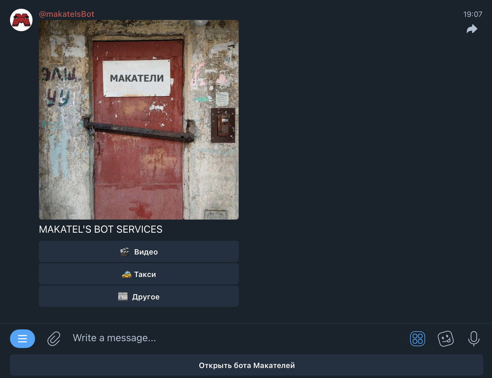
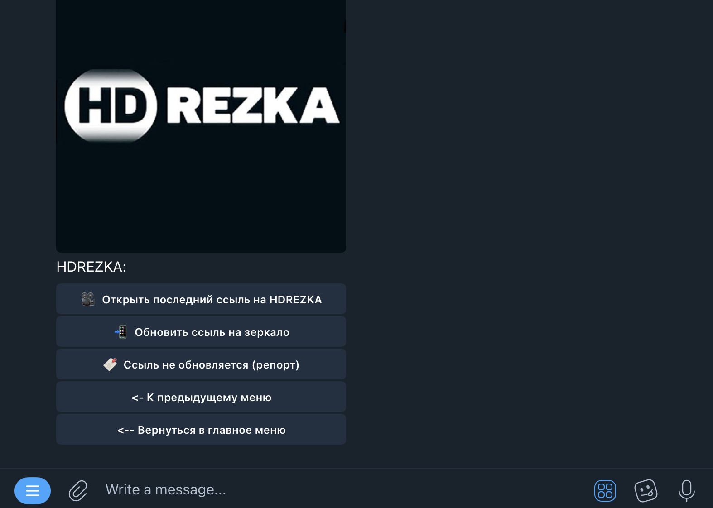
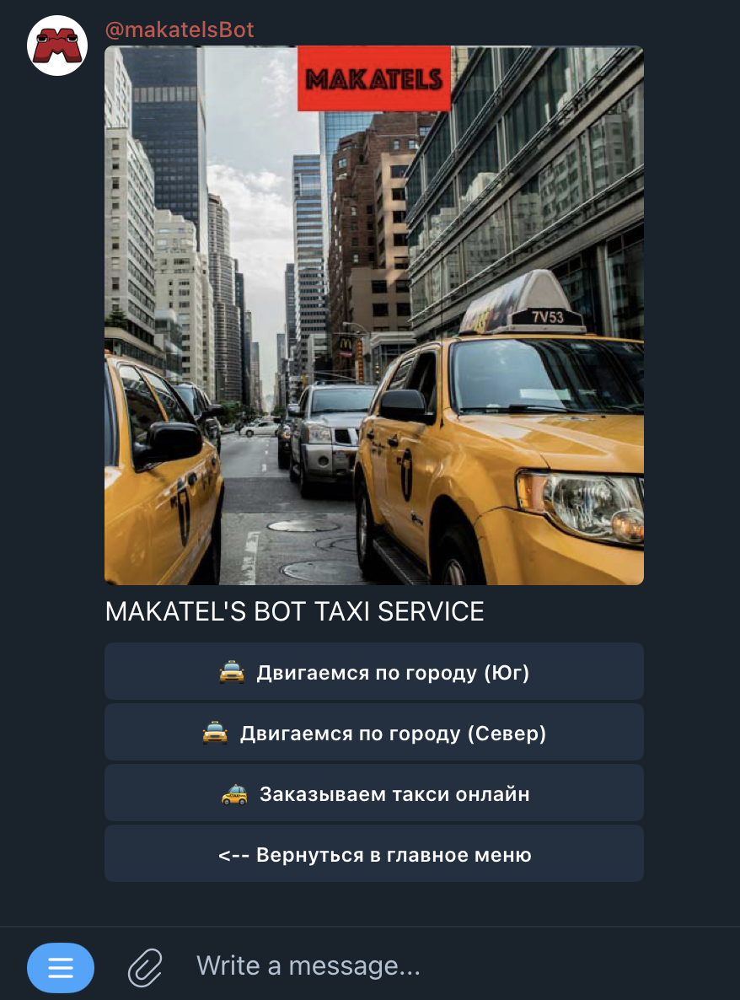
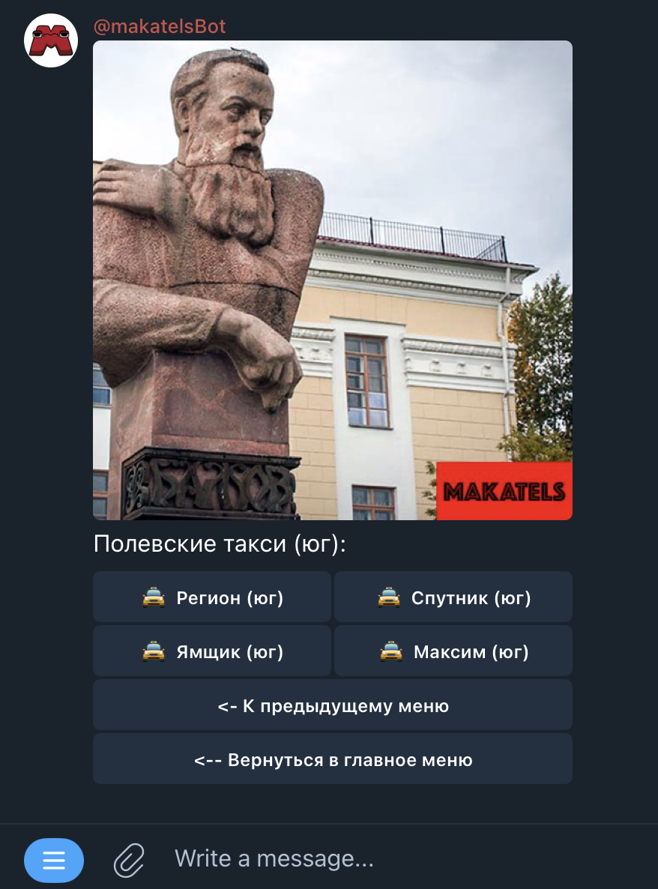
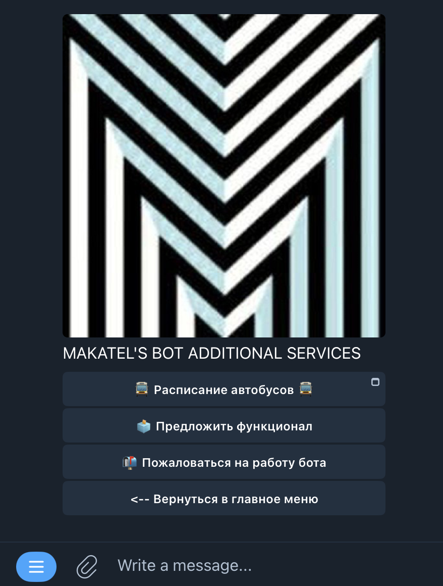
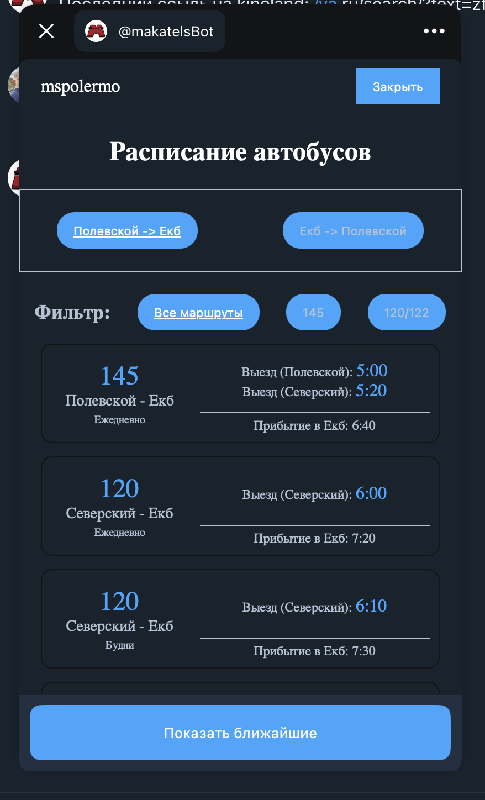

# 🤖 TELEGRAM BOT

## 📝 Описание

Телеграм бот с функционалом:

- Получение/обновление уникальной ссылки на сайты с фильмами без прав на прокат;
- Отображение актуальных сервисов такси в Полевском;
- Мини-приложение "Расписание автобусов" с возможностью посмотреть расписание/обратное расписание автобусов "Полевской - Екатеринбург";
- Пожаловаться на работу бота/предложить функционал.

  
  
  
  
  
  
    

### 🔧 html-parser

Сервер с парсингом расписания автобусов - [end-point](/html-parser/README.md)

### 🖥️ miniApp

Фронтенд "Расписание автобусов" - [miniApp](/miniApp/README.md)

### ⚙️ tgBot

Логика бота (ООП) - [tgBot](/tgBot/README.md)
